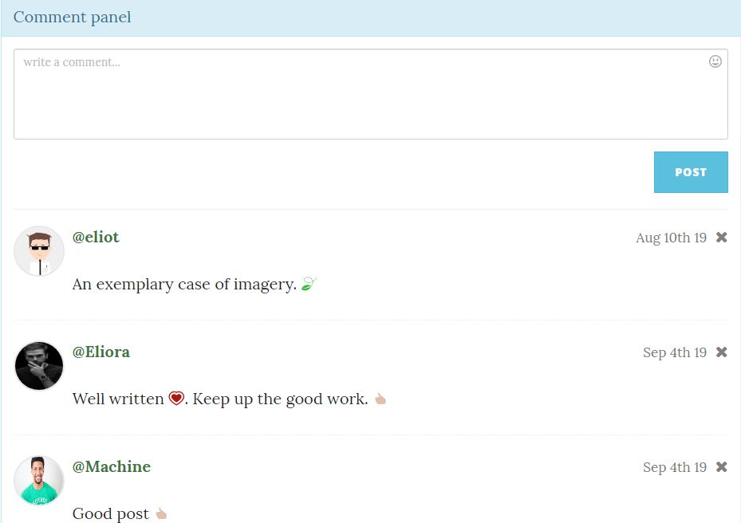

# Posteoid

## Introduction

Posteoid is a traditional application built using NodeJs. It is **simple**, **fast**, **secure** Blog App with _beautiful_, _responsive_ and _user-friendly_ interface where users can create as many posts after creating their profile. 

The app also provides the functionality of editing and deleting the posts by the creator of the post. The posts made are public and anyone can read the posts and comment on them or download them as pdf file. 

## Description

### Home

The static home page welcomes the user and makes the user comfortable with the workarounds of the app.


### About

The About section is responsible for giving detailed information to the user about the creator of the app and the features and functionalities of the app. It helps the user to know the work-arounds of the app. 

This section can also be used to solve the frequently asked questions by the user. 

#### Feature 

If one wants to save the information for future reading then a feature has been added to save the data as a pdf file which can be download. For this feature **Web Scraping** has been done using the ***cheerio*** module available [here](https://www.npmjs.com/package/cheerio)

### Contact

Sometimes the user has certain queries which are not present in the _FAQs_:exclamation:. Therefore the contact section has been provided where the user can send the query message to the creator team. The messages will get stored in the database handled by the creator team which will respond to the user's query :+1:. 

The database that has been used in this project is a **mongodb** database using _mongoose_ module.


### Login and Resgister

To use the app to create or read posts and access the various functionalities of this app one has to register themselves. The registration option is available on the login page. Error validation of the input is done and when the data is correct, it is stored in the database.

#### Features

##### Security - Encryption

The password of the respective user is encrypted and then stored in the database. During authentication the entered password is encrytped and then compared hence no decryption takes place.

##### Identity - Tokenization

When the user logs in, after validation of the login information a **token** is generated for the particular user. Sign in once and the app keeps you logged in till you log out. Once the user logs out the token will automatically be deleted. 

Detailed error validation has also been done with display of messages to the user.

Login Page Img1            |  Login Page Img2            |  Register Page
:-------------------------:|:-------------------------:|:-------------------------:
  |    |  

### User Home Page

The user lands his Home Page after successfully logging in. On the Home Page all the posts made by different users are displayed as shown below. The user can access the posts through the individual cards.

First Image            |  Second Image
:-------------------------:|:-------------------------:
  |  

### Post

The post page displays the entire content of the post created by the respective user including the masthead image uploaded.


#### Features

##### Edit and Delete Post

The post can be edited or deleted. Moreover only the user has the authority to edit or delete the post. Others will not be allowed. 

Appropriate error or success messages are displayed.

##### Pdf Download 

The pdf can also be generated for the post and downloaded. The style and alignment of the content has been maintained in the generated pdf file.

##### Comment Section

There is a comment section below the post where one can make comments on the post. See below:



>Following are the **features** of the Comment Panel.

1. Anyone can comment on the post.
2. The comment can also be deleted. Only the respective user can delete the comment. Others will not be allowed. See the images below the steps.
3. The user image is automatically loaded from the database in the comment section.
4. The feature for adding emojis to the comment has also been provided. Further using _colon_ symbol followed by emoticon name the sugesstions are given in the comment section. See the image **Emoji1** and **Emoji2** at the end.
5. Any creator of a post would like to see the number of times the post has been viewed or the number of times the pdf has been download. Therefore a feature has been added which keeps a record of the **views** of a particular post and the **pdf downloads**. This information is _only_ displayed to the _user_. See the image below.


Emoji1         |  Emoji2
:-------------------------:|:-------------------------:
  |  

```
The image below shows the total number of views by other users on a particular post and the number 
of downloads of the pdf. Only the creator can see this.

```


```
The images below show the edit and delete pages for a particular post.
```

Edit Page         |  Delete Page
:-------------------------:|:-------------------------:
  |  


### Create Post

A user can create post here.

First Image            |  Second Image
:-------------------------:|:-------------------------:
  |  

#### Feature

A text editor has been included where the user can use different styles, format, text-colors, background-colors to write the content. Further to set the header an image upload option has been provided. See the images below.

First Image            |  Second Image            |  Third Image          
:-------------------------:|:-------------------------:|:-------------------------:
  |    |  


## Prerequisites

To run the project in local enviroment one will need the following things: 

**Node Package Manager** to be installed in the system. To install it in the system click [here](https://www.npmjs.com/get-npm). 

**NodeJs** is required. Download from [here](https://nodejs.org/en/download/)

**MongoDB** is required to store all the data used in the app. Download from [here](https://www.mongodb.com/download-center)

Any text editor would work, I prefer **Visual Studio Code**. Download from [here](https://code.visualstudio.com/download)

Now when the above are downloaded successfully, open the project in VSC and using the terminal run the command **npm install**. This will install all the required dependencies. 

## Running the program

To run the app follow the steps given below:

```
1. Open a terminal
2. Go the project directory
3. Run the command 'nodemon server.js'
4. Open the browser and go to url 'localhost:3000'
4. The app will open.
```

## Testing

To test the model files run the command _npm run test-watch_.

## Author

* **Suyash Awasthi** - *Initial work* - [suyash2810](https://github.com/suyash2810)


## License

This project is licensed under the MIT License - see the [LICENSE.md](https://github.com/Suyash2810/Posteoid/blob/master/LICENSE) file for details.